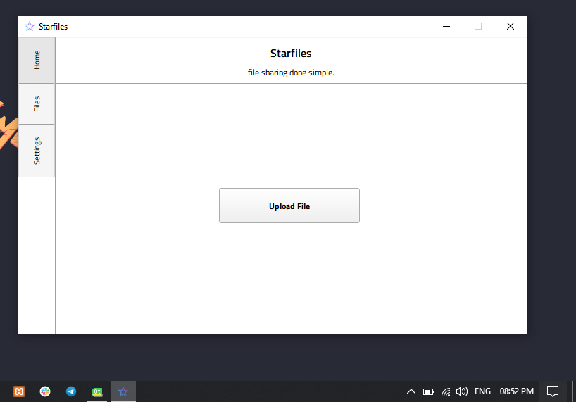
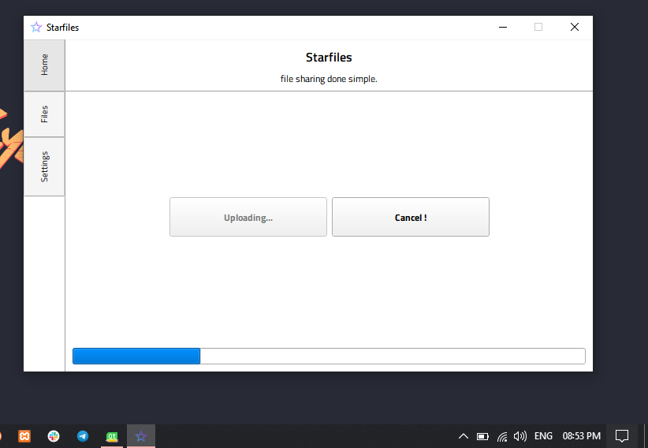
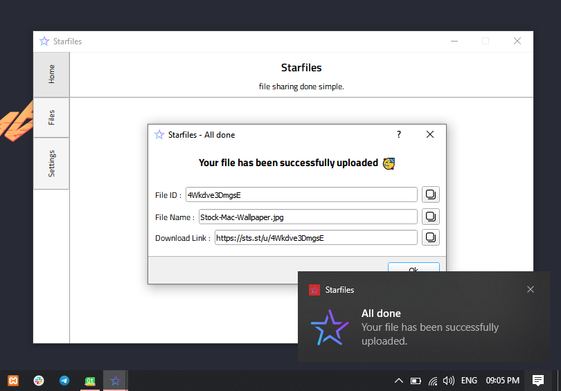
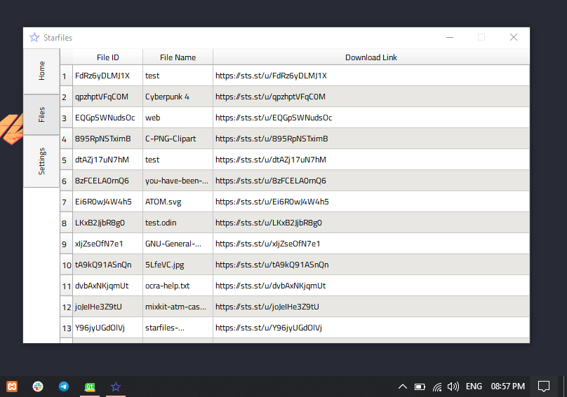

## Starfiles App

Starfiles App is an open-source desktop client for [starfiles.co](https://starfiles.co) which focus on the simple and privacy 🕴🏽.

whenever you made something cool, and you feel like u wanna share it with your community.
just hit up the app and start uploading 🤝🏽.

### Screen's

### Download

Help us to improve this application by testing the beta release : [v1.0.0-Beta](https://github.com/Lil-Nickel/StarfilesApp/releases/tag/v1.0.0)

### Support or Contact
You can join starfiles community on discord here : 

or contact with the developer at:

  
  

made with ❤ in 🌍
